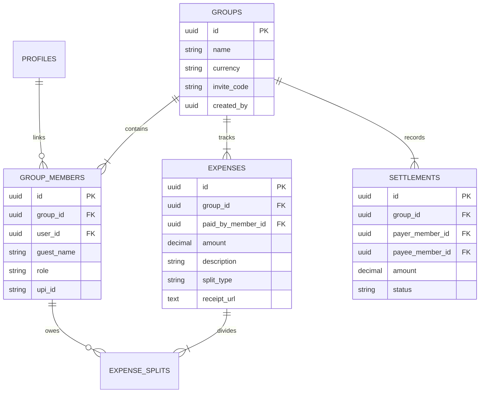

# ⚡ Batwaara — Smart, Developer-First Group Expense & Debt Settlement Platform

> **The smartest, fastest way to split payments and settle group debts without the drama.**

---

## 🌟 Overview

**Batwaara** is an ultra-modern, high-performance group expense management platform designed with a **Stripe / Neo-Grotesque tech aesthetic**. Built with Next.js 16, Tailwind CSS v4, Clerk Authentication, and Supabase PostgreSQL, Batwaara combines real-time bill splitting, **AI-powered receipt OCR scanning**, **voice/natural language expense logging**, and a **Greedy Debt Simplification Algorithm** that minimizes group cash transfers into the absolute minimum transactions needed.

---

## ✨ Key Features

### 1. 🧮 Greedy Debt Simplification Algorithm
- Eliminates messy $N \times N$ individual payments across groups.
- Calculates net balances and computes the **optimal minimum directed transactions** required to clear all group debts.

### 2. 💳 1-Click UPI Deep Linking & Dynamic QR Codes
- Generates direct `upi://pay` intent deep-links for **Google Pay**, **PhonePe**, **Paytm**, and **BHIM UPI**.
- Displays dynamic, scannable UPI QR codes for instant mobile banking settlements.

### 3. 🛡️ Settle Up Authorization Guard
- Full financial transparency: all group members can view debt balances.
- **Strict Authorization**: The **Settle Up (UPI)** button is enabled **ONLY** for the designated debtor who owes money, while non-debtors see a disabled `Waiting for [Payer]` state.

### 4. 📷 AI OCR Receipt Scanner
- Upload or drop any receipt photo.
- Uses **OCR Space Engine** to automatically extract merchant name, date, total amount, and category, pre-filling your expense modal in seconds.

### 5. 🎙️ Voice & Natural Language Expense Logger
- Type or speak natural language prompts (e.g. *"Rahul paid 1500 for dinner split with Priya and Alex"*).
- Speech-to-Text parsing automatically extracts amount, description, category, and matches group member names.

### 6. 🧾 Permanent Base64 & Supabase Storage Receipt System
- Multi-tier storage fallback ensuring scanned receipt images are **permanently preserved** in PostgreSQL Base64/CDN format without expiring on session reload.
- Attached receipt thumbnail previews with full-screen viewer modal.

### 7. 🎨 Stripe / Neo-Grotesque Tech Aesthetic
- Crisp typography powered by `Plus Jakarta Sans` for headers, `Inter` for interface elements, and `JetBrains Mono` with `tabular-nums` for financial data.
- Built-in **Bayer 4x4 Canvas Dither Shader**, **3D Tier Video Modals**, and an **Orbiting Payment Integrations Grid**.

---

## 🛠️ Technology Stack

| Component | Technology |
| :--- | :--- |
| **Framework** | [Next.js 16 (App Router + Turbopack)](https://nextjs.org/) |
| **Language** | [TypeScript](https://www.typescriptlang.org/) |
| **Styling** | [Tailwind CSS v4](https://tailwindcss.com/) |
| **Animations** | [Framer Motion](https://www.framer.com/motion/) & [Aceternity UI](https://ui.aceternity.com/) |
| **Authentication** | [Clerk OAuth](https://clerk.com/) (Google, GitHub, Email) |
| **Database** | [Supabase PostgreSQL](https://supabase.com/) with Row-Level Security (RLS) |
| **Icons** | [Lucide React](https://lucide.dev/) & [Tabler Icons](https://tabler-icons.io/) |
| **OCR Engine** | [OCR Space API](https://ocr.space/) |
| **3D Rendering** | [Cobe WebGL Globe](https://github.com/shuding/cobe) & HTML Canvas API |

---

## 🚀 Getting Started

### Prerequisites
- **Node.js**: `v20.0.0` or higher
- **npm** or **bun** / **pnpm**

### 1. Clone the Repository
```bash
git clone https://github.com/AbhinavMangalore16/edclarity-ai.git
cd edclarity-ai
```

### 2. Install Dependencies
```bash
npm install
```

### 3. Configure Environment Variables
Create a `.env.local` file in the root directory:

```env
# Clerk Authentication
NEXT_PUBLIC_CLERK_PUBLISHABLE_KEY=pk_test_...
CLERK_SECRET_KEY=sk_test_...
NEXT_PUBLIC_CLERK_SIGN_IN_URL=/sign-in
NEXT_PUBLIC_CLERK_SIGN_UP_URL=/sign-up
NEXT_PUBLIC_CLERK_AFTER_SIGN_IN_URL=/dashboard
NEXT_PUBLIC_CLERK_AFTER_SIGN_UP_URL=/dashboard

# Supabase Database
NEXT_PUBLIC_SUPABASE_URL=https://your-project.supabase.co
NEXT_PUBLIC_SUPABASE_ANON_KEY=eyJhbGciOi...
SUPABASE_SERVICE_ROLE_KEY=eyJhbGciOi...

# AI & OCR (Optional)
OCR_SPACE_API_KEY=K8...
OPENAI_API_KEY=sk-...
```

### 4. Run the Development Server
```bash
npm run dev
```

Open [http://localhost:3000](http://localhost:3000) in your browser to start splitting payments!

---

## 📊 Database Schema Overview

Batwaara uses a clean, relational schema in Supabase PostgreSQL:



---

## 📄 License

Distributed under the **MIT License**. See `LICENSE` for more information.

---

<p center="align">
  Crafted with ❤️ for frictionless group payments.
</p>
